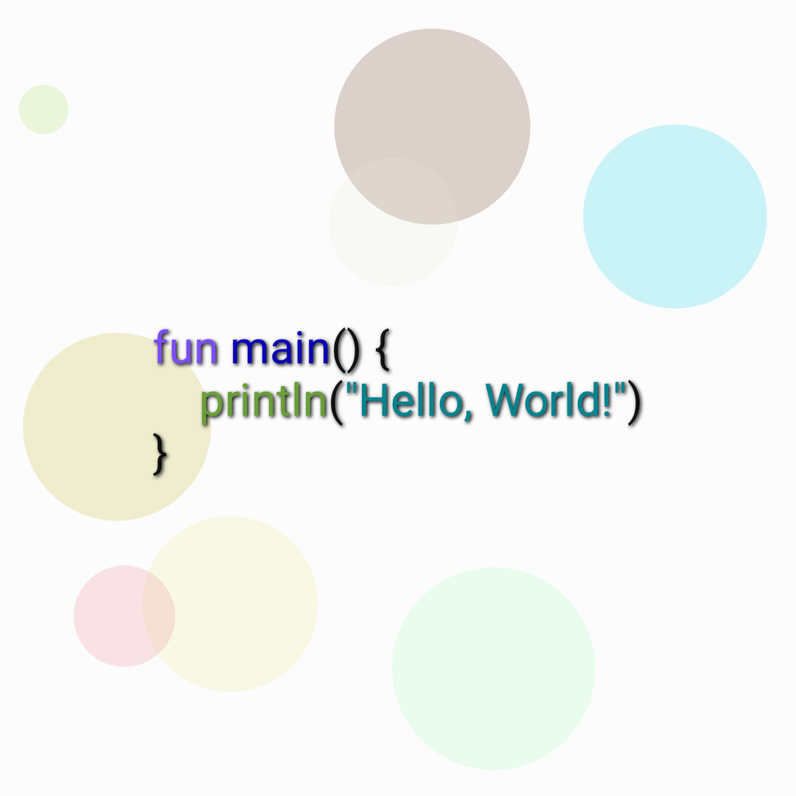

# Android Compose App for generating Hello Crypto World images

To create library of generated images just launch the app, select first language and wait until all items are generated.
Then check **/data/data/com.andrewkuliahin.cryptohelloworld/files/** directory for items.

### Mutations

* Paradigms - circles
* Year - the older, the darker
* Every time new code syntax and background color

### Example

